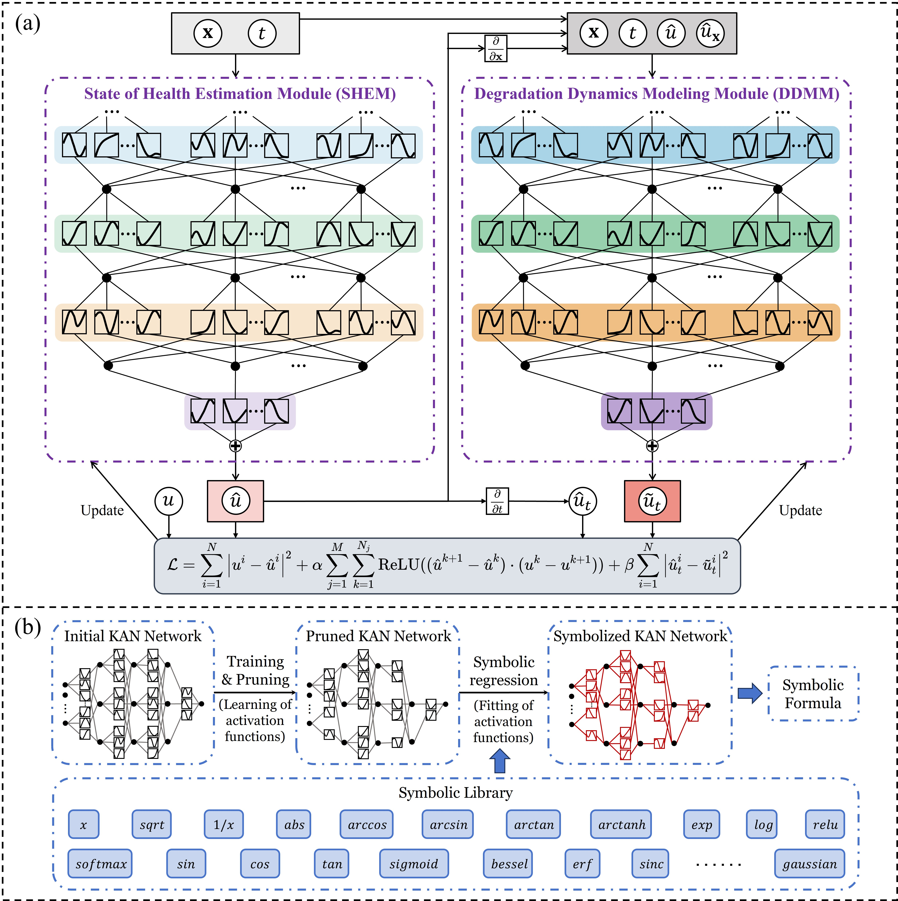
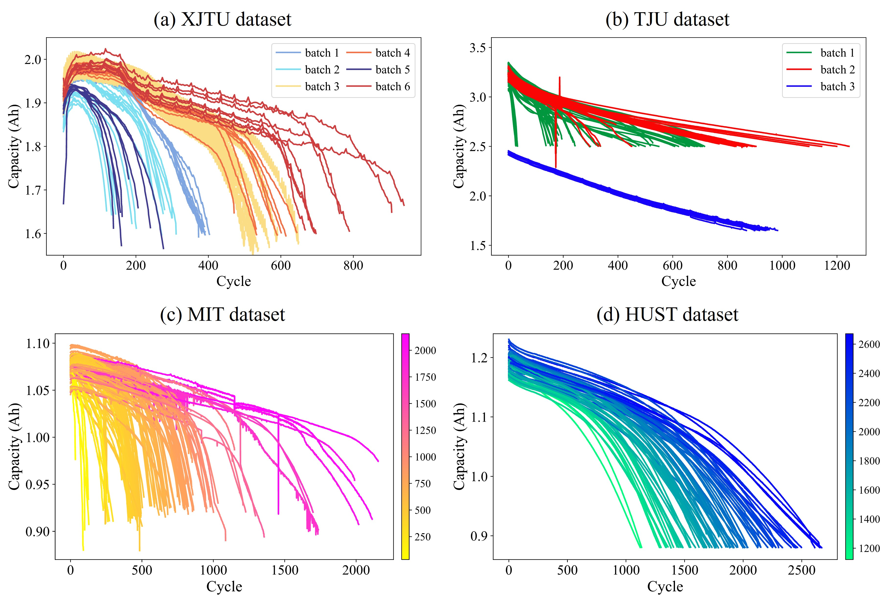
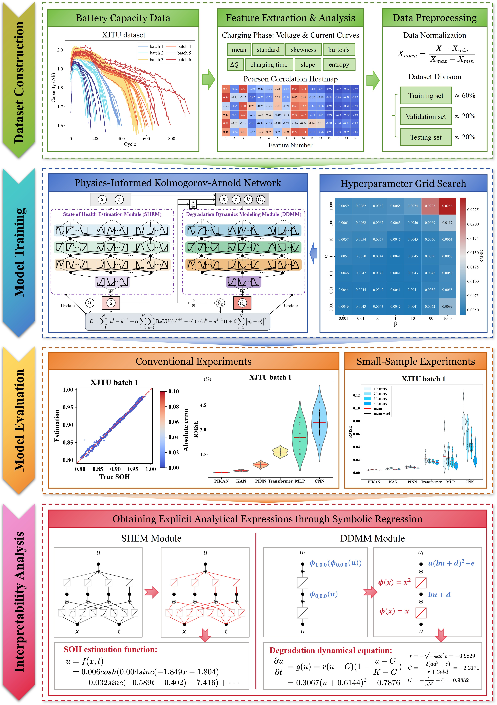

# Physics-informed and interpretable state of health estimation framework for lithium-ion batteries

> **Authors:** Lei Liu, Jiahui Huang, Bo Peng, Ying Li, Peng Wang, Xianhao Wang, Hongwei Zhao, Bin Li.

This repo contains the code and data from our paper published in Journal of Energy Storage.

Website: https://www.sciencedirect.com/science/article/pii/S2352152X26005244.

## Table of contents

- [Physics-informed and interpretable state of health estimation framework for lithium-ion batteries](#physics-informed-and-interpretable-state-of-health-estimation-framework-for-lithium-ion-batteries)
  - [Table of contents](#table-of-contents)
  - [1. Abstract](#1-abstract)
  - [2. PIKAN's architecture](#2-pikans-architecture)
  - [3. Environment configuration](#3-environment-configuration)
    - [3.1. Create environment](#31-create-environment)
    - [3.2. Activate environment](#32-activate-environment)
  - [4. Datasets](#4-datasets)
  - [5. Usage](#5-usage)
    - [5.1. Model training and validation](#51-model-training-and-validation)
      - [5.1.1. Regular and small-sample scenarios](#511-regular-and-small-sample-scenarios)
      - [5.1.2. Zero-shot and few-shot transfer scenarios](#512-zero-shot-and-few-shot-transfer-scenarios)
    - [5.2. Model performance evaluation](#52-model-performance-evaluation)
      - [5.2.1. Regular and small-sample scenarios](#521-regular-and-small-sample-scenarios)
      - [5.2.2. Zero-shot and few-shot transfer scenarios](#522-zero-shot-and-few-shot-transfer-scenarios)
    - [5.3. Model interpretability analysis](#53-model-interpretability-analysis)
    - [5.4. Visualization](#54-visualization)
  - [6. Experimental procedures](#6-experimental-procedures)
  - [7. Main experimental results](#7-main-experimental-results)
    - [7.1. Results of regular experiments on four datasets.](#71-results-of-regular-experiments-on-four-datasets)
    - [7.2. Results of small-sample experiments on the XJTU dataset batch 1 and HUST dataset.](#72-results-of-small-sample-experiments-on-the-xjtu-dataset-batch-1-and-hust-dataset)
    - [7.3. The architecture details of proposed PIKAN model and other baseline models.](#73-the-architecture-details-of-proposed-pikan-model-and-other-baseline-models)
  - [8. Acknowledgments](#8-acknowledgments)
  - [9. Citation](#9-citation)

## 1. Abstract

Accurate state-of-health (SOH) estimation is critical for the safety of lithium-ion batteries. Current data-driven methods face three key challenges: limited accuracy under data scarcity, insufficient physical consistency, and poor interpretability. This study proposes the Physics-Informed Kolmogorov-Arnold Network (PIKAN), establishing a novel interpretable symbiotic co-evolution mechanism that combines and jointly optimizes SOH estimation and degradation mechanism discovery. PIKAN integrates three innovations: (1) the State of Health Estimation Module (SHEM) utilizes the functional decomposition and symbolic representation capabilities of KAN to achieve accurate and interpretable estimation; (2) the Degradation Dynamics Modeling Module (DDMM) uses KAN as a general approximator to adaptively discover degradation dynamical equations without predefined forms; (3) these modules interact bidirectionally, where SHEM provides real-time battery state to guide the equation discovery of DDMM, while DDMM regularizes the output of SHEM through physical constraints, achieving self-regularization and synergistic learning. Comprehensive experiments across four datasets demonstrate that PIKAN outperforms state-of-the-art methods in conventional and transfer scenarios, with maximum 63.4% RMSE reduction in small-sample scenarios. Crucially, symbolic regression transforms the learned model into explicit analytical expressions, revealing the intrinsic decision-making logic of SOH mapping and degradation dynamics. Under mechanism guidance, discovered degradation equations exhibit structural similarity to existing electrochemical models, bridging data-driven discovery with physical theory. The analytical expressions obtained from the PIKAN framework provide actionable insights for practical battery management systems (BMS) and exhibit a certain degree of cross-battery transferability. This study offers a physics-informed interpretable paradigm for intelligent battery management.

## 2. PIKAN's architecture



The overall architecture of PIKAN. (a) The structure of SHEM and DDMM, and the design of the composite loss function. (b) The schematic diagram of symbolic regression technology based on KAN.

## 3. Environment configuration

### 3.1. Create environment

```bash
conda env create -f pikan.yaml
```

### 3.2. Activate environment

```bash
conda activate pikan
```

## 4. Datasets



The capacity degradation curves of the battery datasets. (a) XJTU dataset, (b) TJU dataset, (c) MIT dataset, (d) HUST dataset. The scales on the color bars of
panel (c) and (d) indicate the total number of cycles for each battery cell.

Four publicly available lithium-ion battery datasets have been placed in the `Data/` folder.

The XJTU dataset is available at: https://doi.org/10.5281/zenodo.10963339.

The TJU dataset is available at: https://zenodo.org/record/6405084.

The HUST dataset is available at: https://data.mendeley.com/datasets/nsc7hnsg4s/2.

The MIT dataset is available at: https://data.matr.io/1/projects/5c48dd2bc625d700019f3204.

## 5. Usage

### 5.1. Model training and validation

#### 5.1.1. Regular and small-sample scenarios

Taking the XJTU dataset as an example, the model training and evaluation process is as follows:

```bash
# Use hyperparameter search
python main_our_models_optimize_XJTU.py
# Hyperparameter search is not used
python main_comparision_XJTU.py
```

#### 5.1.2. Zero-shot and few-shot transfer scenarios

All pretrained model parameter files are saved in the `pretrained_models/` folder.

```bash
python main_our_models_fine_tuning.py
```

### 5.2. Model performance evaluation

#### 5.2.1. Regular and small-sample scenarios

Taking the XJTU dataset as an example, the result analysis process is as follows:

```bash
python results_analysis_code/Model_optimize_XJTU_results.py
python results_analysis_code/Model_optimize_XJTU_results_group_mean.py
python results_analysis_code/Comparision_results_XJTU.py
```

#### 5.2.2. Zero-shot and few-shot transfer scenarios

```bash
python results_analysis_code/FineTune_results.py
```

### 5.3. Model interpretability analysis

All interpretability analysis code is saved in the `Notebooks/` folder. Taking the XJTU dataset as an example, the interpretability analysis process is as follows:

Step 1. Dataset construction

- `Notebooks/XJTU_Dataloader.ipynb`

Step 2. Direct symbolizaton

- `Notebooks/PIKAN_XJTU_Var2.ipynb`

Step 3. Prior-guided symbolizatioin

- `Notebooks/PIKAN_XJTU_Var2_PDEAutoDiscovery.ipynb`

All images and videos generated by interpretable analysis are saved in the `Images/` and `Videos/` folders, respectively.

### 5.4. Visualization

All visualizations are saved in the `Figures/` folder. Taking Fig. 1(a) in the paper as an example, the visualization process is as follows:

```bash
python plotter/Figure_1a.py
```

## 6. Experimental procedures



The overall experimental procedures for the proposed PIKAN method.

## 7. Main experimental results

### 7.1. Results of regular experiments on four datasets.

| Dataset        |      | XJTU   |        |        |        |        |        | TJU    |        |        | MIT    | HUST   |
| -------------- | ---- | ------ | ------ | ------ | ------ | ------ | ------ | ------ | ------ | ------ | ------ | ------ |
| Batch          |      | 1      | 2      | 3      | 4      | 5      | 6      | 1      | 2      | 3      | —      | —      |
| PIKAN (ours)   | MAPE | 0.0031 | 0.0089 | 0.0067 | 0.0057 | 0.0085 | 0.0045 | 0.0088 | 0.0118 | 0.0054 | 0.0060 | 0.0057 |
|                | RMSE | 0.0040 | 0.0096 | 0.0082 | 0.0070 | 0.0102 | 0.0068 | 0.0097 | 0.0120 | 0.0051 | 0.0069 | 0.0066 |
| PIKAN (medium) | MAPE | 0.0032 | 0.0085 | 0.0066 | 0.0050 | 0.0077 | 0.0043 | 0.0096 | 0.0128 | 0.0057 | 0.0059 | 0.0060 |
|                | RMSE | 0.0039 | 0.0093 | 0.0080 | 0.0059 | 0.0093 | 0.0066 | 0.0104 | 0.0127 | 0.0054 | 0.0067 | 0.0069 |
| KAN            | MAPE | 0.0041 | 0.0126 | 0.0081 | 0.0064 | 0.0157 | 0.0062 | 0.0103 | 0.0145 | 0.0057 | 0.0060 | 0.0064 |
|                | RMSE | 0.0051 | 0.0128 | 0.0095 | 0.0090 | 0.0177 | 0.0079 | 0.0112 | 0.0150 | 0.0053 | 0.0071 | 0.0078 |
| KAN (medium)   | MAPE | 0.0109 | 0.0119 | 0.0090 | 0.0070 | 0.0112 | 0.0056 | 0.0105 | 0.0155 | 0.0060 | 0.0061 | 0.0072 |
|                | RMSE | 0.0123 | 0.0126 | 0.0107 | 0.0097 | 0.0134 | 0.0074 | 0.0112 | 0.0157 | 0.0056 | 0.0071 | 0.0085 |
| PINN           | MAPE | 0.0060 | 0.0105 | 0.0066 | 0.0074 | 0.0083 | 0.0066 | 0.0106 | 0.0141 | 0.0080 | 0.0067 | 0.0078 |
|                | RMSE | 0.0087 | 0.0115 | 0.0080 | 0.0110 | 0.0104 | 0.0099 | 0.0118 | 0.0136 | 0.0076 | 0.0076 | 0.0089 |
| Transformer    | MAPE | 0.0141 | 0.0161 | 0.0133 | 0.0134 | 0.0136 | 0.0165 | 0.0295 | 0.0309 | 0.0167 | 0.0173 | 0.0310 |
|                | RMSE | 0.0164 | 0.0177 | 0.0161 | 0.0171 | 0.0167 | 0.0212 | 0.0292 | 0.0309 | 0.0160 | 0.0216 | 0.0404 |
| MLP            | MAPE | 0.0232 | 0.0233 | 0.0195 | 0.0211 | 0.0183 | 0.0183 | 0.0130 | 0.0166 | 0.0142 | 0.0079 | 0.0080 |
|                | RMSE | 0.0254 | 0.0269 | 0.0217 | 0.0238 | 0.0219 | 0.0216 | 0.0135 | 0.0159 | 0.0136 | 0.0088 | 0.0089 |
| CNN            | MAPE | 0.0281 | 0.0322 | 0.0211 | 0.0184 | 0.0339 | 0.0181 | 0.0136 | 0.0181 | 0.0129 | 0.0064 | 0.0073 |
|                | RMSE | 0.0343 | 0.0382 | 0.0255 | 0.0226 | 0.0446 | 0.0232 | 0.0144 | 0.0189 | 0.0129 | 0.0075 | 0.0087 |

### 7.2. Results of small-sample experiments on the XJTU dataset batch 1 and HUST dataset.

| Dataset         |      | XJTU   |        |        |        | HUST   |        |        |        |
| --------------- | ---- | ------ | ------ | ------ | ------ | ------ | ------ | ------ | ------ |
| Train batteries |      | 1      | 2      | 3      | 4      | 1      | 2      | 3      | 4      |
| PIKAN (ours)    | MAPE | 0.0030 | 0.0038 | 0.0033 | 0.0032 | 0.0115 | 0.0108 | 0.0101 | 0.0095 |
|                 | RMSE | 0.0040 | 0.0048 | 0.0045 | 0.0041 | 0.0124 | 0.0116 | 0.0112 | 0.0104 |
| PIKAN (medium)  | MAPE | 0.0040 | 0.0034 | 0.0033 | 0.0033 | 0.0180 | 0.0110 | 0.0097 | 0.0088 |
|                 | RMSE | 0.0051 | 0.0045 | 0.0042 | 0.0040 | 0.0234 | 0.0117 | 0.0107 | 0.0098 |
| KAN             | MAPE | 0.0044 | 0.0050 | 0.0039 | 0.0043 | 0.0417 | 0.0123 | 0.0133 | 0.0124 |
|                 | RMSE | 0.0058 | 0.0071 | 0.0052 | 0.0056 | 0.0480 | 0.0134 | 0.0157 | 0.0142 |
| KAN (medium)    | MAPE | 0.0258 | 0.0160 | 0.0081 | 0.0075 | 0.1100 | 0.0143 | 0.0135 | 0.0128 |
|                 | RMSE | 0.0272 | 0.0174 | 0.0094 | 0.0089 | 0.1208 | 0.0159 | 0.0156 | 0.0147 |
| PINN            | MAPE | 0.0068 | 0.0069 | 0.0058 | 0.0051 | 0.0280 | 0.0131 | 0.0141 | 0.0142 |
|                 | RMSE | 0.0083 | 0.0093 | 0.0080 | 0.0072 | 0.0339 | 0.0153 | 0.0159 | 0.0159 |
| Transformer     | MAPE | 0.0185 | 0.0158 | 0.0151 | 0.0133 | 0.0392 | 0.0347 | 0.0369 | 0.0373 |
|                 | RMSE | 0.0216 | 0.0181 | 0.0174 | 0.0158 | 0.0492 | 0.0442 | 0.0475 | 0.0472 |
| MLP             | MAPE | 0.0223 | 0.0208 | 0.0174 | 0.0098 | 0.1949 | 0.0154 | 0.0134 | 0.0136 |
|                 | RMSE | 0.0250 | 0.0234 | 0.0186 | 0.0124 | 0.0945 | 0.0187 | 0.0153 | 0.0156 |
| CNN             | MAPE | 0.0720 | 0.0461 | 0.0353 | 0.0210 | 0.4785 | 0.0395 | 0.0288 | 0.0239 |
|                 | RMSE | 0.0773 | 0.0541 | 0.0418 | 0.0256 | 0.2350 | 0.0475 | 0.0354 | 0.0290 |

### 7.3. The architecture details of proposed PIKAN model and other baseline models.

| Model          | Module | Layer             | Input size | Output size | Number of parameters |
| -------------- | ------ | ----------------- | ---------- | ----------- | -------------------- |
| PIKAN (ours)   | SHEM   | KAN Linear        | 17         | 60          | 75960                |
|                |        | KAN Linear        | 60         | 60          |                      |
|                |        | KAN Linear        | 60         | 32          |                      |
|                |        | KAN Linear        | 32         | 32          |                      |
|                |        | KAN Linear        | 32         | 1           |                      |
|                | DDMM   | KAN Linear        | 34         | 60          | 57000                |
|                |        | KAN Linear        | 60         | 60          |                      |
|                |        | KAN Linear        | 60         | 1           |                      |
| PIKAN (medium) | SHEM   | KAN Linear        | 17         | 34          | 6120                 |
|                |        | KAN Linear        | 34         | 1           |                      |
|                | DDMM   | KAN Linear        | 34         | 17          | 8840                 |
|                |        | KAN Linear        | 17         | 17          |                      |
|                |        | KAN Linear        | 17         | 1           |                      |
| PINN           | SHEM   | Linear + Sin      | 17         | 60          | 7781                 |
|                |        | Linear + Sin      | 60         | 60          |                      |
|                |        | Linear            | 60         | 32          |                      |
|                |        | Linear + Sin      | 32         | 32          |                      |
|                |        | Linear            | 32         | 1           |                      |
|                | DDMM   | Linear + Sin      | 34         | 60          | 5821                 |
|                |        | Linear + Sin      | 60         | 60          |                      |
|                |        | Linear            | 60         | 1           |                      |
| KAN            | —      | KAN Linear        | 17         | 60          | 75960                |
|                |        | KAN Linear        | 60         | 60          |                      |
|                |        | KAN Linear        | 60         | 32          |                      |
|                |        | KAN Linear        | 32         | 32          |                      |
|                |        | KAN Linear        | 32         | 1           |                      |
| KAN (medium)   | —      | KAN Linear        | 17         | 34          | 6120                 |
|                |        | KAN Linear        | 34         | 1           |                      |
| MLP            | —      | Linear + Sin      | 17         | 60          | 7781                 |
|                |        | Linear + Sin      | 60         | 60          |                      |
|                |        | Linear            | 60         | 32          |                      |
|                |        | Linear + Sin      | 32         | 32          |                      |
|                |        | Linear            | 32         | 1           |                      |
| CNN            | —      | ResBlock          | (1, 17)    | (8, 17)     | 8465                 |
|                |        | ResBlock          | (8, 17)    | (16, 9)     |                      |
|                |        | ResBlock          | (16, 9)    | (24, 5)     |                      |
|                |        | ResBlock          | (24, 5)    | (16, 5)     |                      |
|                |        | ResBlock          | (16, 5)    | (8, 5)      |                      |
|                |        | Linear            | 8*5        | 1           |                      |
| Transformer    | —      | Linear            | (17, 1)    | (17, 32)    | 12801                |
|                |        | 1 Encoder layer   | (17, 32)   | (17, 32)    |                      |
|                |        | AdaptiveAvgPool1d | (32, 17)   | (32, 1)     |                      |
|                |        | Linear            | 32*1       | 1           |                      |

Note: PIKAN (ours) has the same number of layers and neurons as PINN, but its number of parameters is far greater than that of PINN. KAN has the same number of layers and neurons as MLP, but its number of parameters is far greater than that of MLP. PIKAN (medium) denotes the medium version of the PIKAN model, corresponding to the PIKAN_medium model in the code, which maitains the same order of magnitude as PINN in terms of the number of parameters. KAN (medium) denotes the medium version of the KAN model, corresponding to the KAN_medium model in the code, which maitains the same order of magnitude as MLP in terms of the number of parameters.

## 8. Acknowledgments

Work & Code is inspired by https://github.com/wang-fujin/PINN4SOH.

## 9. Citation

If you find our work useful in your research, please consider citing:

```latex
@article{LIU2026120860,
title = {Physics-informed and interpretable state of health estimation framework for lithium-ion batteries},
journal = {Journal of Energy Storage},
volume = {153},
pages = {120860},
year = {2026},
issn = {2352-152X},
doi = {https://doi.org/10.1016/j.est.2026.120860},
url = {https://www.sciencedirect.com/science/article/pii/S2352152X26005244},
author = {Lei Liu and Jiahui Huang and Bo Peng and Ying Li and Peng Wang and Xianhao Wang and Hongwei Zhao and Bin Li}
}
```

If you have any problems, contact me via liulei13@ustc.edu.cn.        
